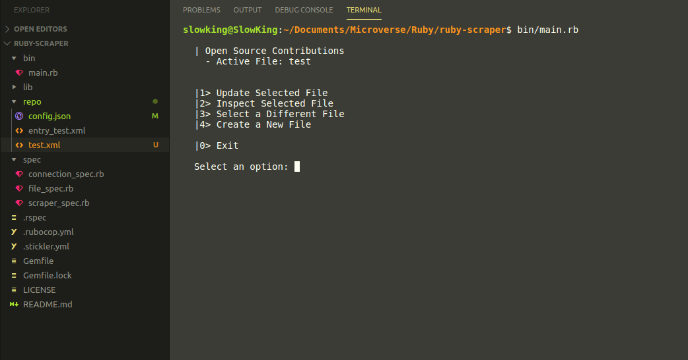

# Ruby Capstone Project: Build your own scraper

> Capstone projects are solo projects at the end of the each of the Microverse Main Technical Curriculum sections.

### Project Requirements

- A scraper developed in Ruby
  - We recommend to use [Nokogiri gem](https://github.com/sparklemotion/nokogiri)
- You choose the website that you want to scrap the info from
- The README must include instructions on how to use the scraper and code examples

Developing the project, you should follow the best practices that you already learned in the previous projects, like setting-up a code linter, using Github flow, testing your business logic, writing good commit messages and a good README.

This program will try to fetch the most recent Open Source repositories searching for contributions from the website [www.codetriage.com](https://www.codetriage.com). You can also specify the language to search for.

## Built With

- Ruby,
- [Nokogiri](https://github.com/sparklemotion/nokogiri)
- VSCode

## Getting Started

**Just clone the repo and put the files anywhere. To run the program you just need to write in the terminal** `$ bin/main.rb` **from the repo directory**

To get a local copy up and running follow these simple example steps.

### Prerequisites

You need to have ***Ruby*** installed on your machine ([Check this out](https://www.ruby-lang.org/en/documentation/installation/) for instructions on installing ruby)

### Usage

When the program starts there will be one storage file already opened and selected. It will be shown below the title.
After that you'll see the next five different options:
1. Update selected file: Select this to fetch the most recent data from the web and update the current file.
2. Inspect selected file: This option will print all the contents of the current file. It is recomended to open the file in any text editor though.
3. Select a different file: If you want to select another existing file select this. It will show you all the repo files (*.xml) inside repo/ folder.
4. Create a new file: This will ask you for a name and a language to search for, and then create a new file with your preferences. Make sure to select and update it!
0. Exit: This will finish and close the program.

### Run tests

> There are no available test for now, this is work in progress

## Author

👤 ***Diego Luna Granados***

- Github: [@SlowKingV](https://github.com/SlowKingV)
- Twitter: [@SlowKingVI](https://twitter.com/SlowKingVI)
- Linkedin: [Diego Luna Granados](https://www.linkedin.com/in/diego-luna-granados-64007b197/)

## 🤝 Contributing

Contributions, issues and feature requests are welcome!

Feel free to check the [issues page](https://github.com/SlowKingV/ruby-scraper/issues).

## Show your support

Give a ⭐️ if you like this project!

## Acknowledgments

- Thanks to #Team-73-the-corgis and Microverse for their support!
- Thanks to @sparklemotion for create the awesome [Nokogiri gem](https://github.com/sparklemotion/nokogiri).
- Thanks to [CodeTriage](https://www.codetriage.com) where all the data is gathered from.

## 📝 License

This project is [MIT](LICENSE) licensed.
